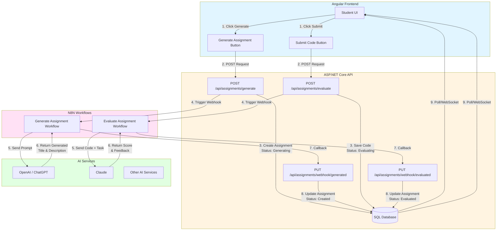
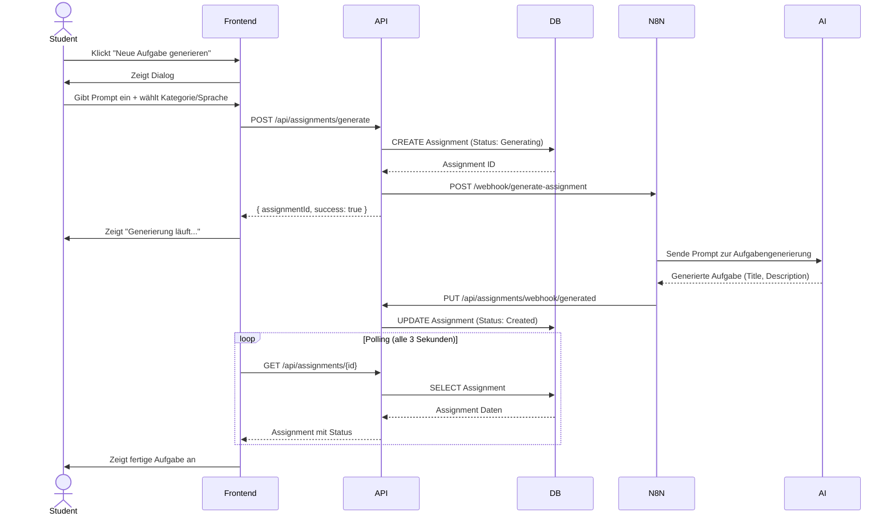
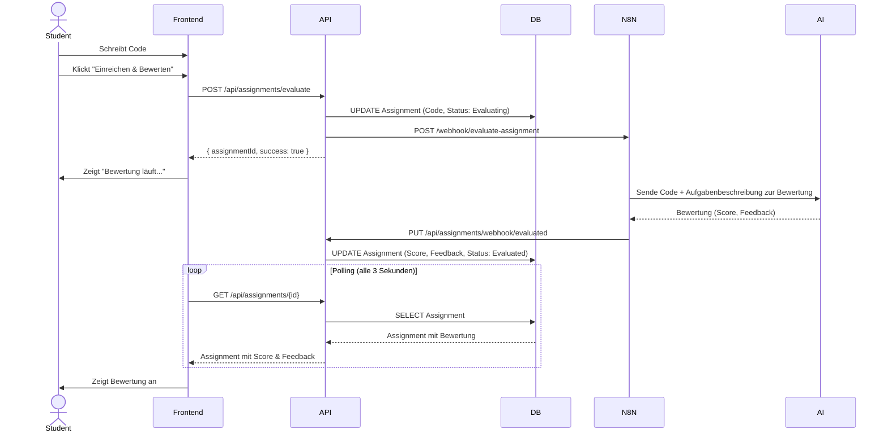
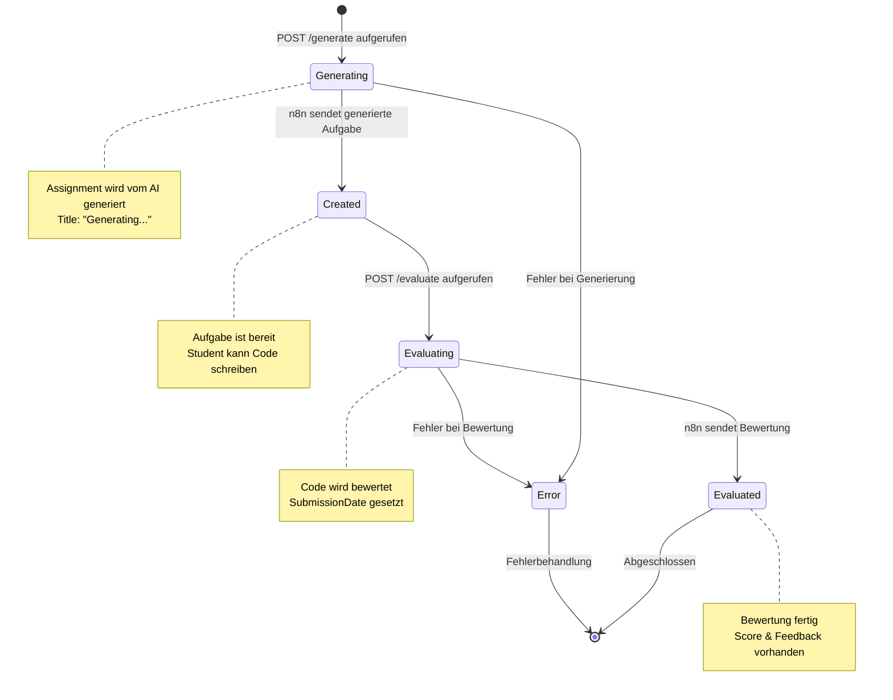
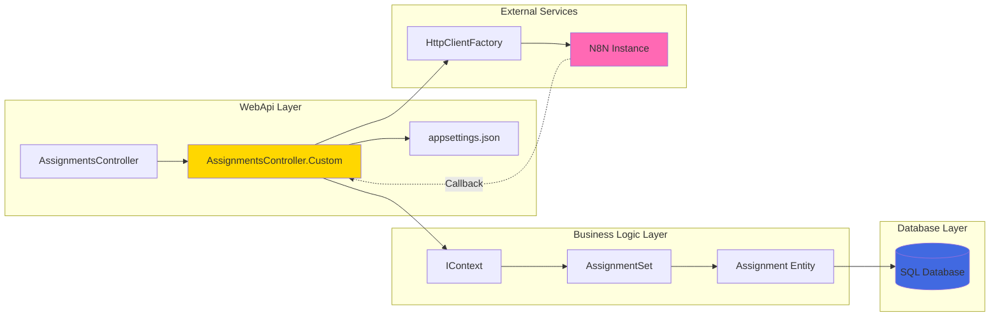
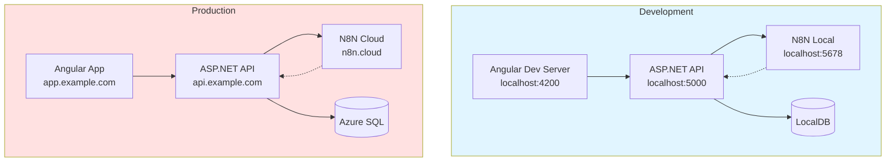
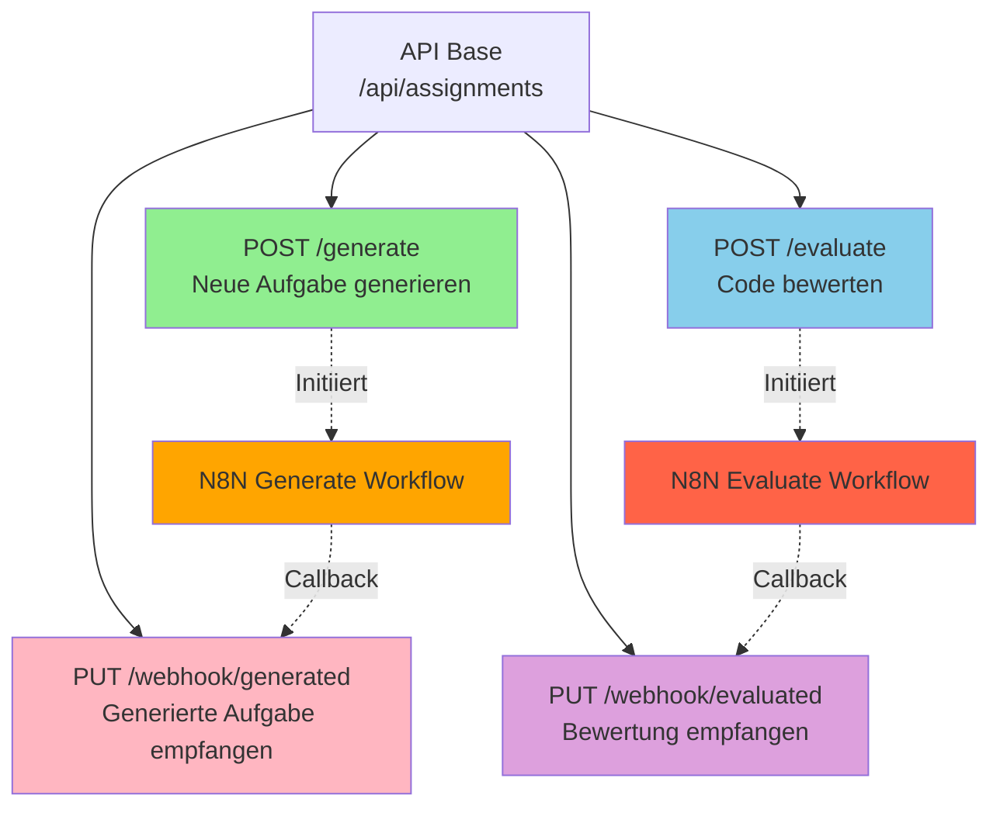

# N8N Workflow Architecture

## System-Diagramm

---

## Sequenzdiagramm: Aufgabenerstellung

---

## Sequenzdiagramm: Code-Bewertung

---

## Zustandsdiagramm: Assignment Status

---

## Komponenten-Diagramm

---

## Deployment-Übersicht

---

## API Endpoints Übersicht

Diese Diagramme visualisieren die gesamte Architektur und helfen beim Verständnis der Workflow-Integration! ??
